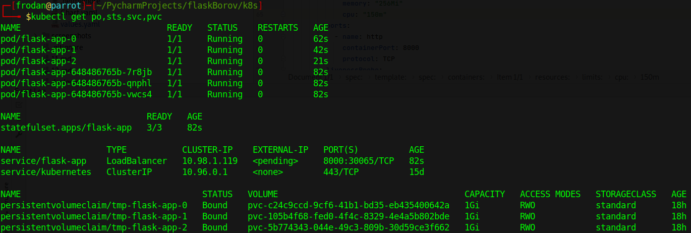
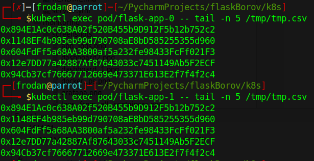

### Output

#### I have no differences between the output, but it may exist because all pods are writing to the same file, which leads to Race Condition.

#### Ordering guarantee is unnecessary in our case because all apps have same functionality, and they are independent of each other.