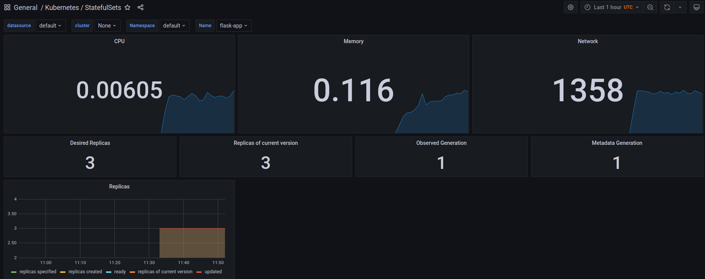
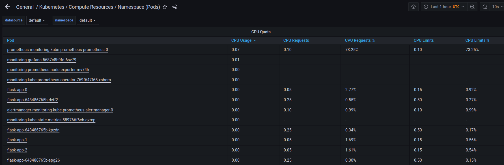
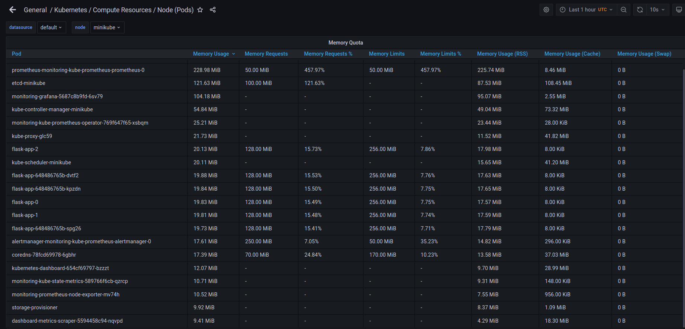
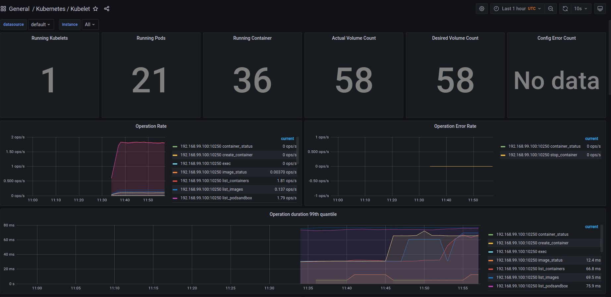
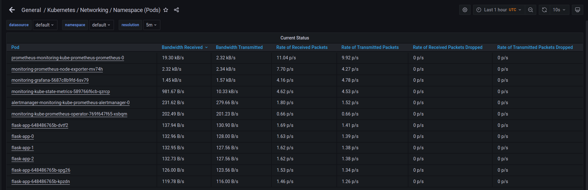
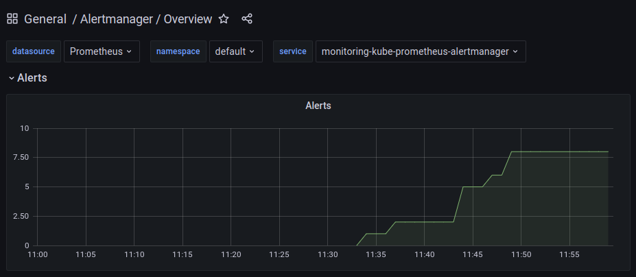
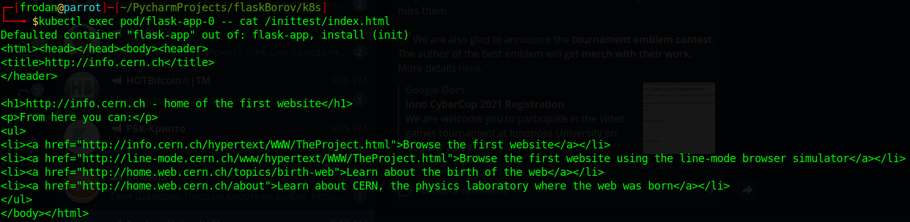

### Components:
#### The Prometheus Operator
Addon for simple Prometheus installation inside Kubernetes stack.

#### Highly available Prometheus
Just Prometheus.

#### Highly available Alertmanager
Tool for alert handling.

#### Prometheus node-exporter
Metrics collector for Prometheus.

#### Prometheus Adapter for Kubernetes Metrics APIs
Plugin to replace default metrics server in Kubernetes by Prometheus.

#### kube-state-metrics
Service to get states of pods and etc as metrics.

#### Grafana
UI with dashboards and filters for metrics.


###
```bash
┌─[frodan@parrot]─[~/PycharmProjects/flaskBorov/k8s]
└──╼ $kubectl get po,sts,svc,pvc,cm
NAME                                                         READY   STATUS    RESTARTS   AGE
pod/alertmanager-monitoring-kube-prometheus-alertmanager-0   2/2     Running   0          3m3s
pod/flask-app-0                                              1/1     Running   0          3m53s
pod/flask-app-1                                              1/1     Running   0          3m33s
pod/flask-app-2                                              1/1     Running   0          3m23s
pod/flask-app-648486765b-dvtf2                               1/1     Running   0          3m53s
pod/flask-app-648486765b-kpzdn                               1/1     Running   0          3m53s
pod/flask-app-648486765b-spg26                               1/1     Running   0          3m53s
pod/monitoring-grafana-5687c8b9fd-6sv79                      2/2     Running   0          3m28s
pod/monitoring-kube-prometheus-operator-769f647f65-xsbqm     1/1     Running   0          3m28s
pod/monitoring-kube-state-metrics-589766f6cb-qzrcp           1/1     Running   0          3m28s
pod/monitoring-prometheus-node-exporter-mv74h                1/1     Running   0          3m28s
pod/prometheus-monitoring-kube-prometheus-prometheus-0       2/2     Running   0          3m2s

NAME                                                                    READY   AGE
statefulset.apps/alertmanager-monitoring-kube-prometheus-alertmanager   1/1     3m3s
statefulset.apps/flask-app                                              3/3     3m53s
statefulset.apps/prometheus-monitoring-kube-prometheus-prometheus       1/1     3m2s

NAME                                              TYPE           CLUSTER-IP       EXTERNAL-IP   PORT(S)                      AGE
service/alertmanager-operated                     ClusterIP      None             <none>        9093/TCP,9094/TCP,9094/UDP   3m3s
service/flask-app                                 LoadBalancer   10.103.28.150    <pending>     8000:30992/TCP               3m53s
service/kubernetes                                ClusterIP      10.96.0.1        <none>        443/TCP                      15d
service/monitoring-grafana                        ClusterIP      10.102.134.227   <none>        80/TCP                       3m28s
service/monitoring-kube-prometheus-alertmanager   ClusterIP      10.97.102.103    <none>        9093/TCP                     3m28s
service/monitoring-kube-prometheus-operator       ClusterIP      10.102.51.29     <none>        443/TCP                      3m28s
service/monitoring-kube-prometheus-prometheus     ClusterIP      10.107.233.69    <none>        9090/TCP                     3m28s
service/monitoring-kube-state-metrics             ClusterIP      10.103.166.140   <none>        8080/TCP                     3m28s
service/monitoring-prometheus-node-exporter       ClusterIP      10.109.176.198   <none>        9100/TCP                     3m28s
service/prometheus-operated                       ClusterIP      None             <none>        9090/TCP                     3m2s

NAME                                    STATUS   VOLUME                                     CAPACITY   ACCESS MODES   STORAGECLASS   AGE
persistentvolumeclaim/tmp-flask-app-0   Bound    pvc-c24c9ccd-9cf6-41b1-bd35-eb435400642a   1Gi        RWO            standard       21h
persistentvolumeclaim/tmp-flask-app-1   Bound    pvc-105b4f68-fed0-4f4c-8329-4e4a5b802bde   1Gi        RWO            standard       21h
persistentvolumeclaim/tmp-flask-app-2   Bound    pvc-5b774343-044e-49c3-809b-30d59ce3f662   1Gi        RWO            standard       21h

NAME                                                                     DATA   AGE
configmap/config-app                                                     1      3m53s
configmap/kube-root-ca.crt                                               1      15d
configmap/monitoring-grafana                                             1      3m28s
configmap/monitoring-grafana-config-dashboards                           1      3m28s
configmap/monitoring-grafana-test                                        1      3m28s
configmap/monitoring-kube-prometheus-alertmanager-overview               1      3m28s
configmap/monitoring-kube-prometheus-apiserver                           1      3m28s
configmap/monitoring-kube-prometheus-cluster-total                       1      3m28s
configmap/monitoring-kube-prometheus-controller-manager                  1      3m28s
configmap/monitoring-kube-prometheus-etcd                                1      3m28s
configmap/monitoring-kube-prometheus-grafana-datasource                  1      3m28s
configmap/monitoring-kube-prometheus-k8s-coredns                         1      3m28s
configmap/monitoring-kube-prometheus-k8s-resources-cluster               1      3m28s
configmap/monitoring-kube-prometheus-k8s-resources-namespace             1      3m28s
configmap/monitoring-kube-prometheus-k8s-resources-node                  1      3m28s
configmap/monitoring-kube-prometheus-k8s-resources-pod                   1      3m28s
configmap/monitoring-kube-prometheus-k8s-resources-workload              1      3m28s
configmap/monitoring-kube-prometheus-k8s-resources-workloads-namespace   1      3m28s
configmap/monitoring-kube-prometheus-kubelet                             1      3m28s
configmap/monitoring-kube-prometheus-namespace-by-pod                    1      3m28s
configmap/monitoring-kube-prometheus-namespace-by-workload               1      3m28s
configmap/monitoring-kube-prometheus-node-cluster-rsrc-use               1      3m28s
configmap/monitoring-kube-prometheus-node-rsrc-use                       1      3m28s
configmap/monitoring-kube-prometheus-nodes                               1      3m28s
configmap/monitoring-kube-prometheus-persistentvolumesusage              1      3m28s
configmap/monitoring-kube-prometheus-pod-total                           1      3m28s
configmap/monitoring-kube-prometheus-prometheus                          1      3m28s
configmap/monitoring-kube-prometheus-proxy                               1      3m28s
configmap/monitoring-kube-prometheus-scheduler                           1      3m28s
configmap/monitoring-kube-prometheus-statefulset                         1      3m28s
configmap/monitoring-kube-prometheus-workload-total                      1      3m28s
configmap/prometheus-monitoring-kube-prometheus-prometheus-rulefiles-0   28     3m3s
```

### Screenshots






Init container:
