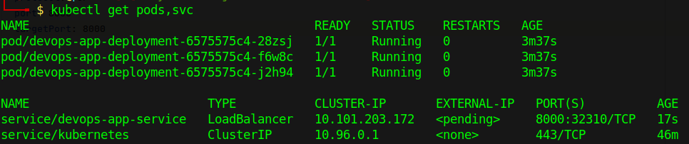

## Console Outputs:
### Without configs
```bash
kubectl get pods,svc
```
```bash
NAME                       READY   STATUS    RESTARTS   AGE
pod/app-7459f77fbc-wlrpt   1/1     Running   0          6m12s

NAME                 TYPE           CLUSTER-IP      EXTERNAL-IP   PORT(S)          AGE
service/app          LoadBalancer   10.110.164.33   127.0.0.1     8000:31872/TCP   4m13s
service/kubernetes   ClusterIP      10.96.0.1       <none>        443/TCP          29m
```
### With configs
