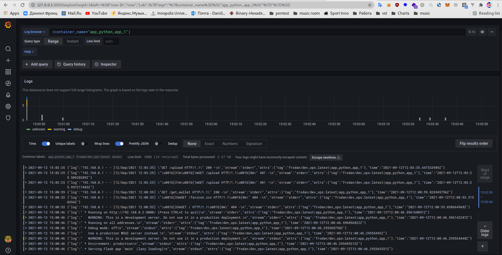
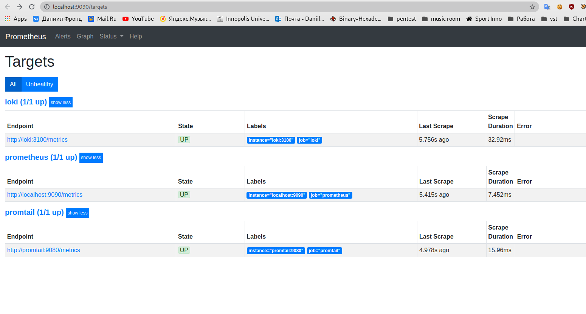

# Logging Report
Configurations were made with help of:
https://raw.githubusercontent.com/grafana/loki/v2.3.0/production/docker-compose.yaml
https://github.com/black-rosary/loki-nginx

# Best Practices
- When creating a new dashboard, make sure it has a meaningful name
- Do log rotation
- Use one format for logs
- Upload logs to storage, like s3

# Screenshots
- Working Grafana
   

- Working Loki
   

- Docker ps lab 7
   

- Working Prometheus
   

- First Dashboard
  
 
- Second Dashboard
  

- Logs From All containers
  
